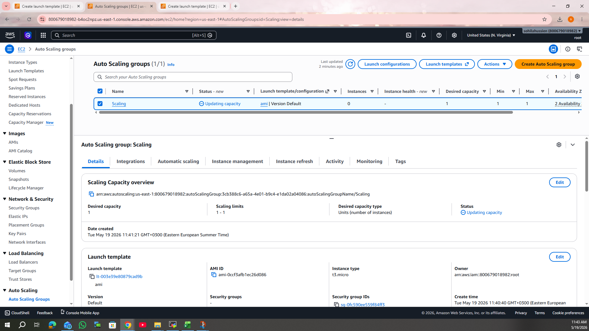

# AWS Flask RDS Project

A simple cloud-based web application built with Flask and deployed on AWS using EC2, RDS, and Auto Scaling.

---

## 🏗️ Architecture

User → Auto Scaling Group (EC2 Instances) → RDS MySQL
---

---

## ⚙️ Tech Stack

- Python (Flask)
- AWS EC2
- AWS RDS (MySQL)
- AWS Auto Scaling Group
- Security Groups

---

## ✨ Features

- Insert & retrieve data from MySQL (RDS)
- Web interface using Flask
- Scalable backend using Auto Scaling
- Cloud deployment on AWS

---

## 📈 Auto Scaling

AWS Auto Scaling Group is used to manage EC2 instances automatically.

- Launches instances when needed
- Replaces unhealthy instances
- Maintains availability and scalability

**Configuration:**
- Launch Template: Flask EC2 instance
- Min: 1 | Desired: 1 | Max: (your config)

📸 Screenshot:

---

## 🗄️ Database

- Amazon RDS (MySQL)
- Table: users (id, name)

---

## 📸 Screenshots

- Web App → `screenshots/website.png`
- EC2 → `screenshots/EC2.png`
- RDS → `screenshots/RDS.png`
- Security Group → `screenshots/SecurityGroup.png`
- Terminal → `screenshots/terminal.png`

---

## 📌 How it works

1. User accesses Flask app on EC2
2. Data is stored in RDS database
3. Auto Scaling ensures app availability

---

## 👨‍💻 Author

AWS Cloud Project – Flask + RDS + Auto Scaling
