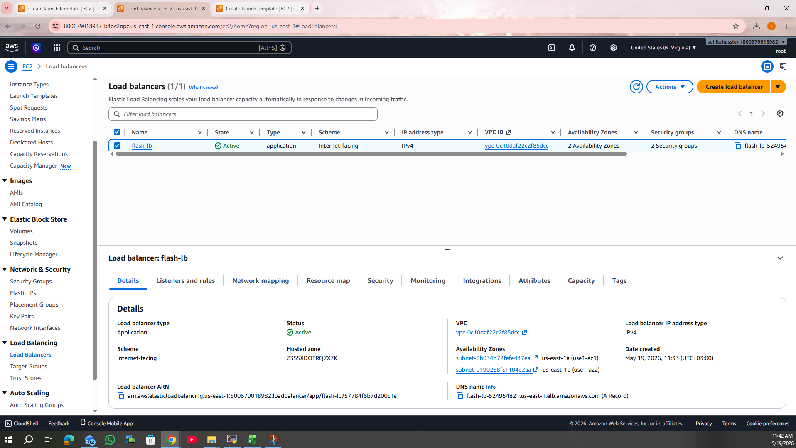

# AWS Flask RDS Project

A simple cloud-based web application built with Flask and deployed on AWS using EC2, RDS, and Auto Scaling.

---

## 🏗️ Architecture

User → Application Load Balancer → Auto Scaling Group (EC2 Instances) → RDS MySQL
---

---

## ⚙️ Tech Stack

- Python (Flask)
- AWS EC2
- AWS RDS (MySQL)
- AWS Auto Scaling Group
- Application Load Balancer (ALB)
- Security Groups

---

## ✨ Features

- Insert & retrieve data from MySQL (RDS)
- Web interface using Flask
- Load balanced traffic using ALB
- Scalable backend using Auto Scaling
- Cloud deployment on AWS

---

## 📈 Auto Scaling & Load Balancer

The system uses:
- **Application Load Balancer (ALB)** to distribute traffic across instances
- **Auto Scaling Group** to automatically manage EC2 instances based on demand

This ensures:
- High availability
- Fault tolerance
- Scalability under load

📸 Auto Scaling:

📸 Load Balancer:

---

## 🗄️ Database

- Amazon RDS (MySQL)
- Table: users (id, name)

---

## 📸 Screenshots

- Web App → `screenshots/website.png`
- EC2 → `screenshots/EC2.png`
- RDS → `screenshots/RDS.png`
- Security Group → `screenshots/SecurityGroup.png`
- Terminal → `screenshots/terminal.png`

---

## 📌 How it works

1. User accesses the ALB DNS
2. ALB distributes traffic to EC2 instances
3. Flask app processes requests
4. Data is stored in RDS
5. Auto Scaling maintains instance availability

---

## 👨‍💻 Author

AWS Cloud Project – Flask + RDS + Auto Scaling
