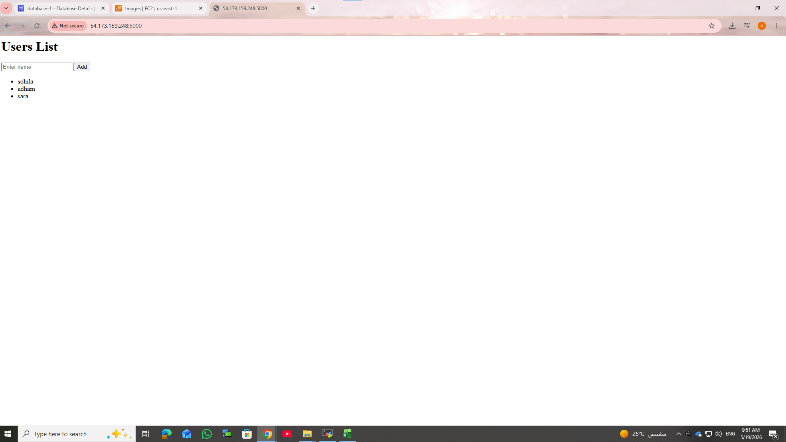
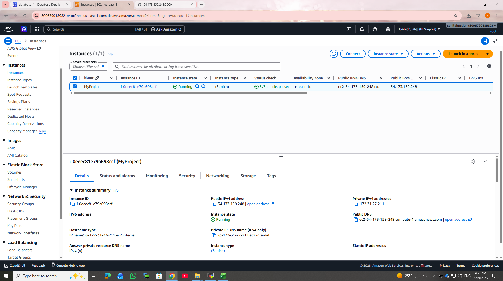
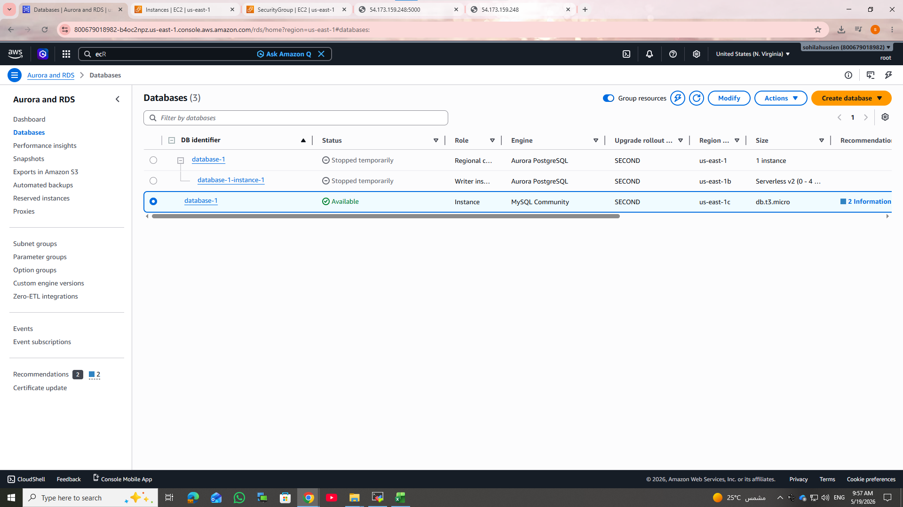
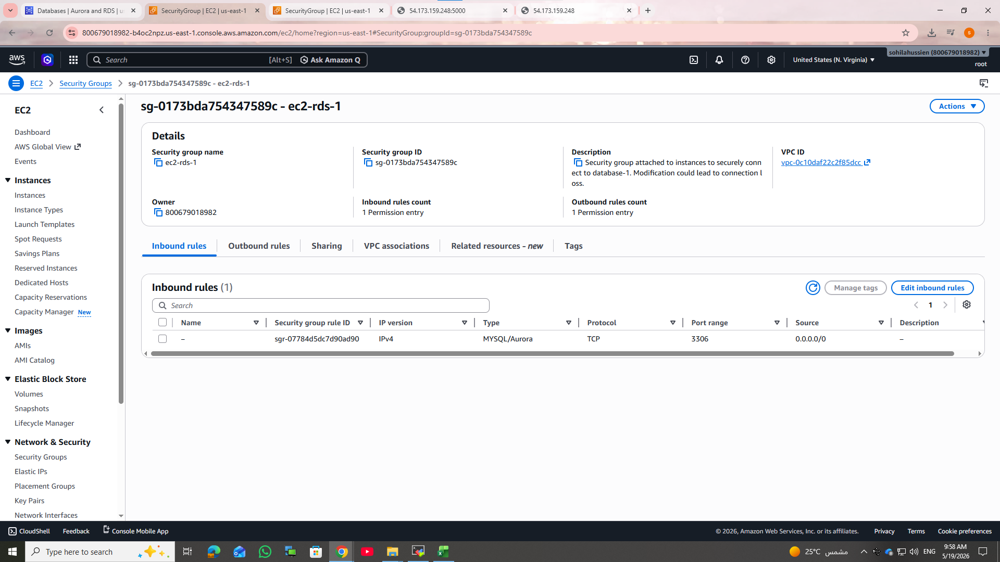
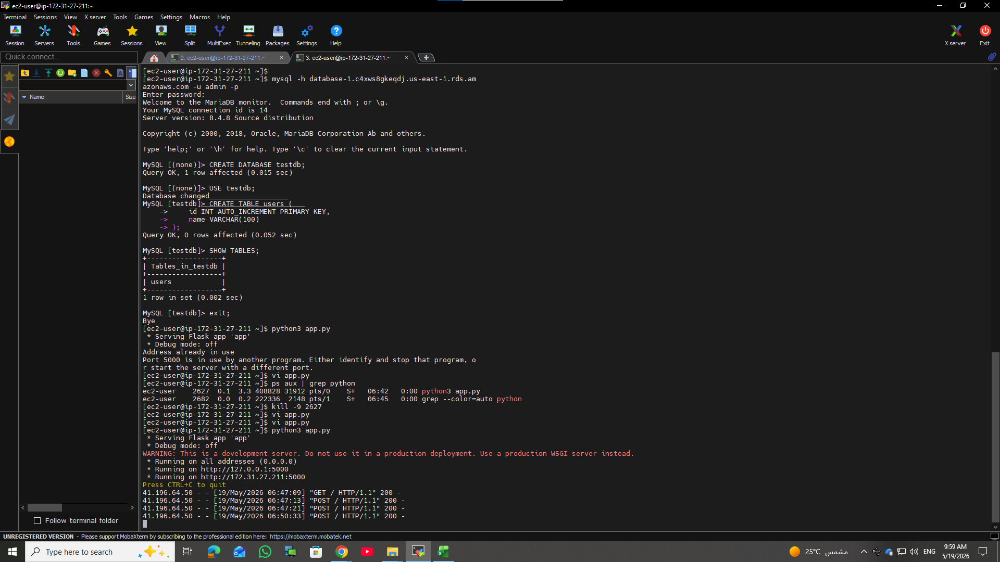

# AWS Flask RDS Project

Simple web application deployed on AWS using:
- EC2
- RDS
- Flask
- Security Groups

---

## Architecture

User -> EC2 Flask App -> RDS MySQL

---

## Screenshots

### Website

### EC2 Instance

### RDS Database

### Security Groups

### Terminal

